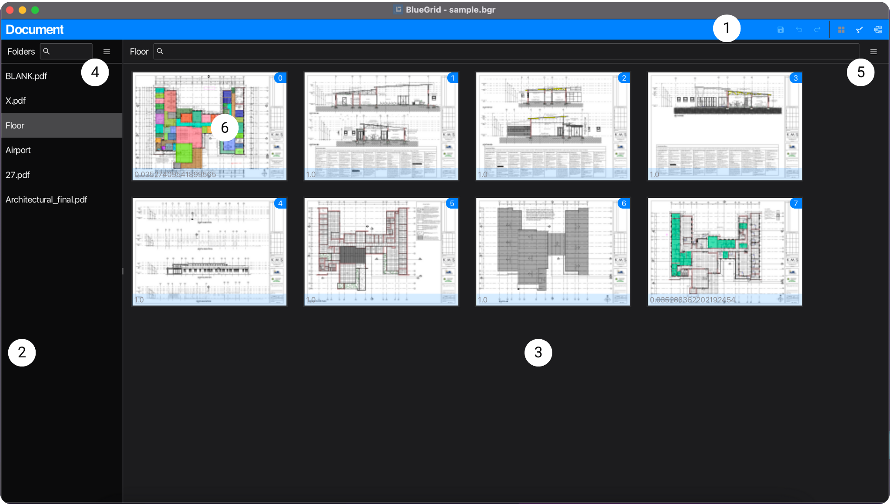

## Application

Application is the main window of BlueGrid, where users perform quantity take-off projects.

Operations in the application are at project level. This means that the changes made in the application are applied to the project. Data of project is stored in the project file.

### User Interface
> The application has an application [Tool Bar](#application-tool-bar) and 3 sub-views: [Documents View](#document-view), [Draw View](#draw-view), and [Catalogs View](#catalogs-view).

> 

> 1. [Application Tool Bar](#application-tool-bar)
> 2. [Sub-view](#sub-view)

> #### Application Tool Bar
```Navigation: Application | Application Tool Bar```

> The **Application Tool Bar** is on the top of the application view and is always visible by default. From the **Application Tool Bar**, you do common operation such as save, undo, redo, and navigate to different sub-views of the application, for the purposes of use. 

> #### Sub-view
```Navigation: Application | Sub-view```

> Sub-view of can be either Documents View, Draw View, or Catalogs View. Each sub-view has its own functionalities and functions. All sub-views share the same project data. The Documents View is the default sub-view of the application, when you open a project.

## Document View
```Navigation: Application | Documents View```

**Documents View** the view of project construction blueprints of PDF folders and pages.

### User Interface
> The user interface is designed to facilitate PDF view (as thumbnails) and simple but powerful PDF blueprints management.

> 

> 1. [Application Tool Bar](#application-tool-bar)
> 2. Folders view
> 3. Pages view
> 4. Folders menu
> 5. Pages menu
> 6. Page thumbnails


> #### Folders View
```Navigation: Application | Documents View | Folders```

> The **Folders view** is a list view that displays all PDF folders of the project. Users can click a folder item in the list to open it. To remove a folder from the list, select the folder item in the list, open [Folder List Menu](#folders-menu), and click delete menu item.
   


