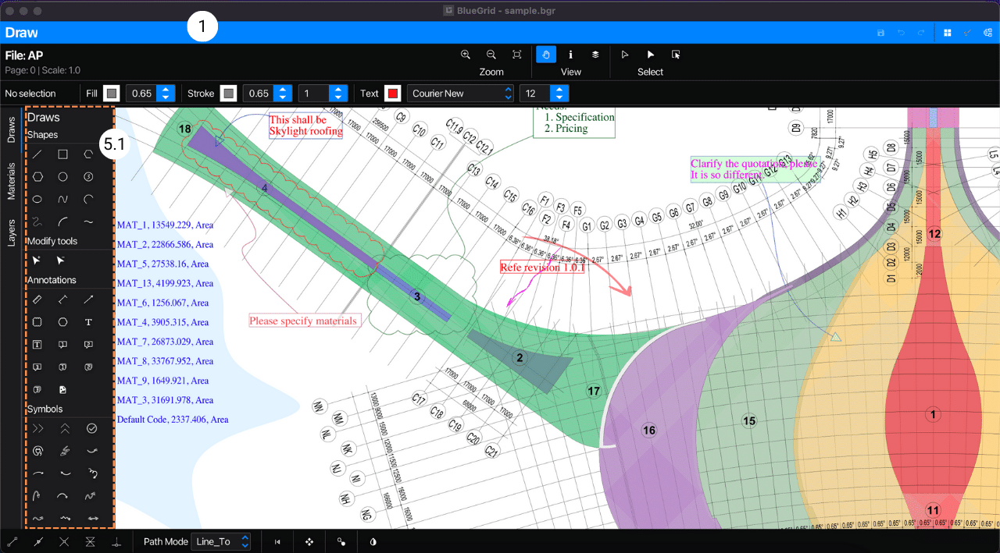
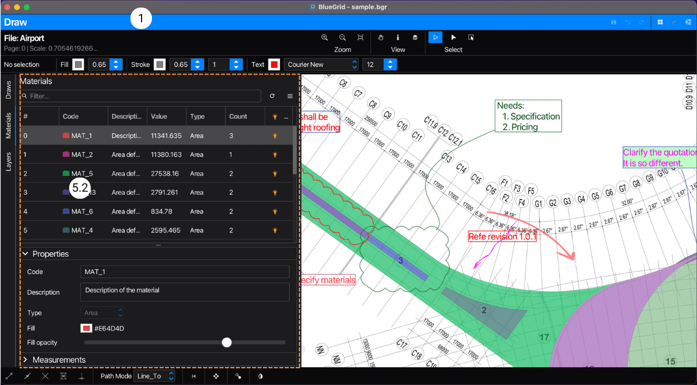
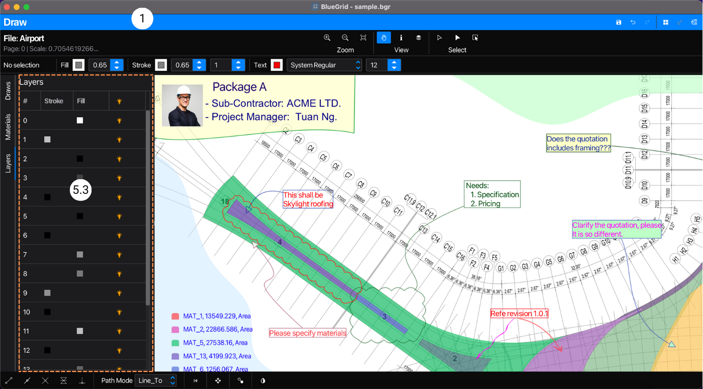

# Application

> *This section provides an overview of the application, its user interface, and its components. Each component will be accompanied by a reference to its detailed documentation for usage instructions.*


<br>

Application is the main window of BlueGrid, where users perform quantity take-off projects.

Operations within the application occur at the project level. This implies that any changes made within the application are applied directly to the project data. This project data is then stored within the project file.

The application features a [Navigation bar](#navigation-bar) and 3 sub-views: [Document view](#document-view), [Draw view](#draw-view), and [Catalog view](#catalog-view). At a given time, only one of these views is displayed. [Document-view](#document-view) is the default sub-view when users open the application. Users can switch between views using the [Navigation bar](#navigation-bar).


 1. [Navigation bar](#navigation-bar)
 2. [Document-view](#document-view)

## Navigation bar
```Navigation: Application | Navigation bar```

The [Navigation bar](#navigation-bar) is on the top of the application view and is always visible by default. From the [Application Tool Bar](#application-tool-bar), users perform common operations such as save, undo, redo, and switch to different sub-views of the application for various purposes. 


## Document view
```Navigation: Application | Document View```

The [Document view](#document-view) displays the project’s PDF blueprints, which include a list view of folders and a grid view of PDF thumbnails. The user interface is designed to facilitate the viewing of PDFs in thumbnail format and provide efficient management of PDF blueprints.


1. [Navigation-bar](#Navigation-bar)
2. [Folders](#folders) 
3. [Pages](#pages) 
4. [Folders menu](#folders-menu)
5. [Pages menu](#folders-menu)
6. [Page thumbnails](#page-thumbnials)
7. [Pages context menu](#pages-context-menu)


### Folders
```Navigation: Application | Document View | Folders```

The [Folders](#folders) provides a list view that displays all the PDF folders of the project. Users can click on a folder item in the list to open it. Upon opening a folder, all the PDF content is displayed as thumbnails in a grid view, referred to as [Pages](#pages). To remove a folder from the list, users need to select the folder item, open the `Folders menu`, and select the option `Delete`.

#### Folders menu
```Navigation: Application | Document view | Folders | Folders menu```

[Folders menu](#folders-menu) is a feature that provides functions for managing PDF folders such as adding, deleting, renaming. To access the menu, users can either right-click the folder list view or click the menu button located in the top-right corner of the folder list view.

### Pages
```Navigation: Application | Document view | Pages```

The [Pages](#pages) feature provides a grid view that displays thumbnails of PDF pages from an opened folder. To open a page, users can either double-click the page thumbnail or select `Open` from the [Page context menu](#page-context-menu). To remove a page, users need to select the page thumbnail, then either open the `Pages menu` or right-click the page thumbnail to open the context menu, and finally select the option `Delete pages`.


#### Pages menu
```Navigation: Application | Document view | Pages | Pages menu```

[Pages menu](#pages-menu) is a feature that provides functions to managing PDF pages of an opened folder such as opening, deleting, appending, importing, exporting, and duplicating. To access the menu, users either click the menu button located in the top-right corner of the page list or right-click the page grid view to open the context menu. Users can also select multiple pages to perform batch operations.

#### Page thumbnails
```Navigation: Application | Document view | Pages | Page thumbnails```

The underlying data of a page thumbnail is the page dataset, which consists of the PDF page, shapes, materials, annotations, and any additional data that users have added to the page. To open a page, users can either double-click the page thumbnail or select the `Open` option in the [Page context menu](#page-context-menu). Upon opening a page, the application automatically switches to the [Draw view](#draw-view) and loads the page dataset into this view.

#### Pages context menu
```Navigation: Application | Document View | Pages | Page context menu```

[Pages context menu](#pages-context-menu) provides functionalities as [Pages menu](#pages-menu) 

For more information about the [Document view](#document-view), please refer to [PDF documents](../pdf).

## Draw view
```Navigation: Application | Draw view```

[Draw view](#draw-view) is the central interface of the application. This is where users perform quantity take-off, create and edit shapes, materials, tags, annotations, images...etc.
When you open a page, the [Draw view](#draw-view) interface appears as follows:


 
1. [Navigation Bar](#navigation-bar)
2. [Draw Toolbar](#draw-toolbar)
3. [Free Shapes Format Toolbar](#free-format-toolbar)
4. [Draw Canvas](#draw-canvas)
5. [Left Panel](#left-panel)
6. [Bottom Bar](#bottom-bar)

### Draw Toolbar
```Navigation: Application | Draw View | Draw Toolbar```

The [Draw Toolbar](#draw-toolbar) provides tools to operate on the [Draw Canvas](#draw-canvas). The tools are categorized into 3 groups: [Zoom](#zoom) which provides zoom utilities, [View](#view) which provides view utilities, and [Select](#select) which provides selection options.

### Free Shapes Format Toolbar
```Navigation: Application | Draw view | Free shapes format toolbar```

The [Free Shapes Format Toolbar](#free-shapes-format-toolbar) is a toolbar that provides tools to style free shapes, texts and annotations. With these tools use can change style properties such as color, line width, opacity, font, font size, etc. of free shapes, texts, or annotations. Tagged shapes are not affected by these tools as they are not free shapes. Tagged shapes are style by their styling tags such as [materials](/material).
 
### Draw canvas
```Navigation: Application | Draw view | Draw canvas```

[Draw canvas](#draw-canvas) is the central component of the [Draw view](#draw-view). The [Draw canvas](#draw-canvas) is layered with a PDF view and a drawing pane which allows users to draw shapes on the PDF page. It is equipped with numerous features and functionalities to facilitate the drawing process.

Shapes of Metric class, drawn by users are used to compute metric values such as count, length, area, and volume. These shapes can be tagged to materials to compute quantity of those materials. 

Shapes of Annotation class, drawn by users are not used to compute metric values. These shapes can not be tagged to materials; they are always free shapes and are formatted using [Free shapes format toolbar](#free-shapes-format-toolbar).

### Left Panel
```Navigation: Application | Draw View | Left Panel```

Left Panel is a panel that allows users to switch to between tab panes of the Draw View. These tabs contain tools and data that co-relate to Draw Canvas's data. The data displayed is at page level. There are 3 tabs: [Draw Tab](#draw-tab), [Material Tab](#material-tab), and [Layer Tab](#layer-tab).

#### Draws TabPane
```Navigation: Application | Draw View | Left Panel | Draws TabPane```
Draws Tab `5.1` is displayed when user select Draws tab in the Left Panel, as follows:


Draws Tab contains drawing tools to draw shapes, add notes, annotations and images...etc. In **Draw TabPane** there are 4 tool sets:

  1. **Shape Tools** allow users to draw 2D shapes that are used to compute metric values such as length, area, and volume. Shapes created using these tools are of Metric class and can be tagged to materials.
  2. **Modify Tools** allow users to change 'native' data of shapes,  e.g: to remove points from a polygon, to insert points to polygon. These tools are not used to add shapes or annotations.
  3. **Annotation Tools** allow users to add texts, annotations such as arrow, callouts, clouds, images..etc. Objects created using these tools are not of Metric class and can not be tagged to materials.
  4. **Symbol Tools** is a dynamic tool set that user can to add, remove, or customize tools. These tools allow users to add blocked shapes which can not be changed 'natively'. Shapes added using these tools are of Metric class can also be used as counting when tagged to materials.

#### Materials TabPane
```Navigation: Application | Draw View | Left Panel | Materials TabPane```

Materials TabPane `5.2` is displayed when user select Materials tab in the Left Panel, as follows:


  
Material Tab is a tab pane that contains material table that will be used to apply/tag to shapes. Once shapes are tagged to with a material, the shape style is bound to the material's style. 
The quantity of the material is the sum of all shapes metric values that are tagged with it. Please take notes that users should trigger [Compute Button](#compute-button) to compute the quantity of the material.
The material table is at page level.

#### Layers Tab
```Navigation: Application | Draw View | Left Panel | Layers TabPane```

Layers Tab `5.3` is displayed when user select Layers tab in the Left Panel, as follows:
 


Layers TabPane is a tab pane that contains layer table that will be used to manage rendering objects in the PDF page by turning on/off layers. This feature will be useful when the PDF page has many layers and users want to focus on specific layers as well as to reduce noise. 


### Bottom bar
```Navigation: Application | Draw View | Bottom Bar```

Bottom Bar is a bar that provides additional assisting options to the tool that is being used. For example, when user select a draw tool to draw shapes, users can select options of point snaps on the Bottom Bar to assist drawing shapes precisely. 
