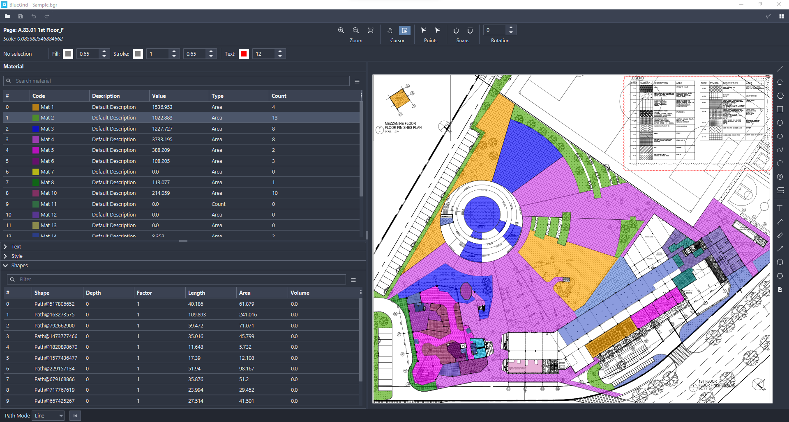
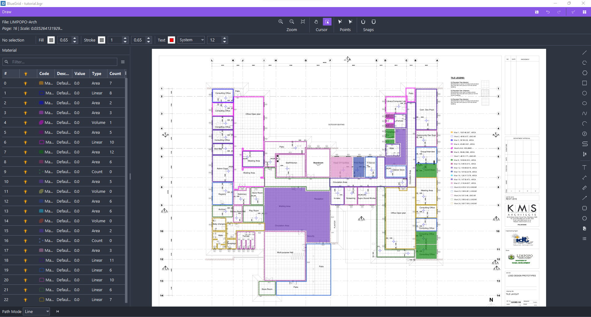
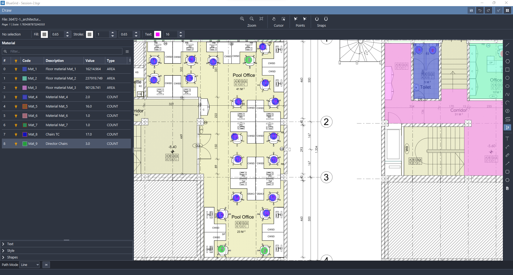
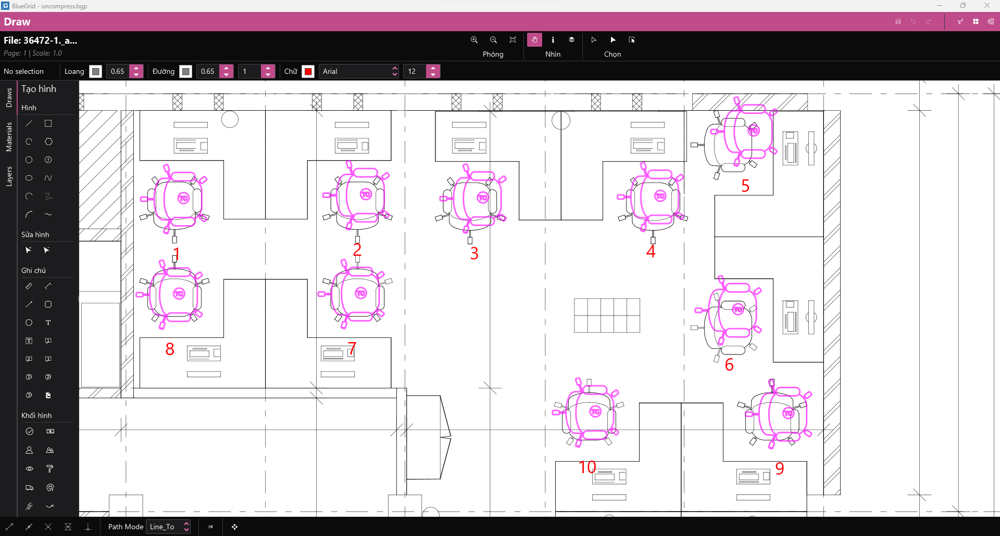
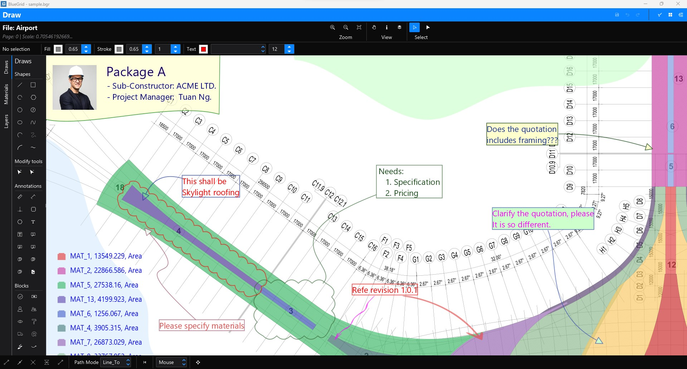
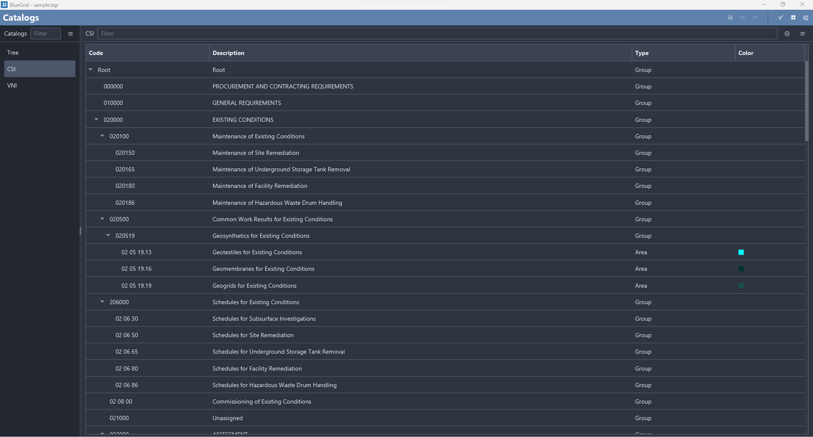

[//]: # (<h1 style="color: darkorange">We are regularly shipping new updates and features. )

[//]: # (Your project data is long-term supported.  )

[//]: # (Please stay updated!</h1>)

[//]: # ()
[//]: # (
)
<h1>THE TAKE-OFF SOFTWARE</h1>

# Implemented features and functions
* **PDF support**: Supports PDF files with vector and image formats.
* **Bill of Material**: Lists or exports the bill of material directly on PDF blueprints or to csv (excel) files.
* **Import and Export**: Imports and exports files to and from PDF, CSV, JSON, etc. for re-use and sharing.
* **Fast and precise point snap**: Provides fast and precise point snap for accurate measurements.
* **Real-time rendering**: Renders in real-time with thin line mode for the best user experience.
* **Drawing tools**: Provides drawing tools to create shapes, markups, and annotations with metric properties for various use cases.
* **Note-taking**: Allows you to add notes with text, callout, cloud, and unlimited block shapes.
* **Shape manipulation**: Enables you to transform, flip, rotate, scale, resize, and style shapes, markups, notes, and annotations.
* **Material coding**: Codes and standardizes materials for easy identification.
* **Drag-and-drop material**: Allows you to drag and drop materials onto shapes.
* **PDF layer**: Provides layer on/off functionality to reduce noise.
* **Work Breakdown Structure (WBS)**: Enables you to build, add, modify, customize, and standardize WBSs.
* **3D stack view**: Provides a 3D view and animation for convenient work review.

[//]: # (<h3>On-plan features and functions</h3>)

[//]: # (* **Select snap**: Enables snap while transforming shapes.)

[//]: # (* **Select shapes in PDF**: Creates shapes with pdf selection.)

[//]: # (* **Select text in PDF blueprint**: Selects and copies text from PDF blueprints.)

[//]: # (* **Find text in PDF blueprint**: Enables text search in PDF.)

[//]: # (* **Compare/Review PDF**: Compares two versions of a blueprint.)

[//]: # (* **Auto find and count**: Automatically counts the number of similar blocks.)

[//]: # (* **Pick shapes and convert to symbol**: Picks a shape on a PDF and converts it into a block tool.)

[//]: # (* **Other quantity take-off tools**: Gradually fulfills the need of the industry.)

[//]: # (* **BlueGrid SDK for Python**: Allows conversion and transformation of data.)

[//]: # (* **Cloud and enterprise functions**: Supports quantity management at the enterprise level.)

<h3>Demo</h3>
<figure markdown>
  
  
  
  
  
  
  
  
  
  
  
  
</figure>

