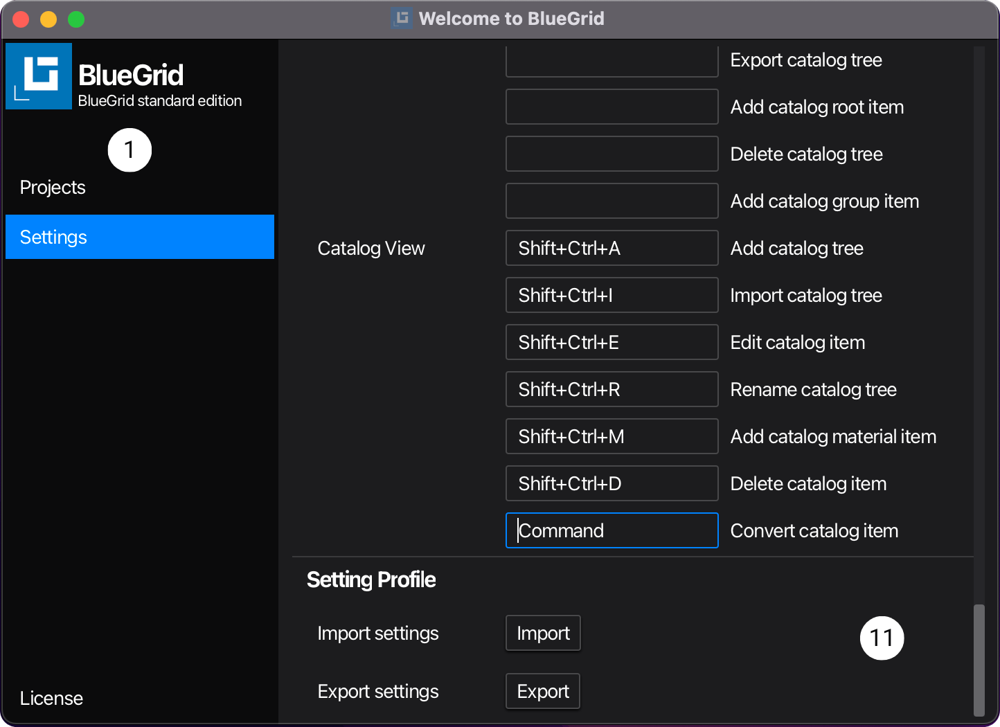

# User interface
    
BlueGrid app divides its user interface into four main views:

1. [Stater](#starter)
2. [Document View](#document-view)
3. [Draw View](#draw-view)
4. [Catalog View](#catalog-view)

## Starter

Starter view is the entry window of the application. From starter view users open, create, modify shortcut keys, or customize looks and feels as well as set application parameters to optimize usage experience. 

Operations in the starter view are at application level.
### User Interface
>  When you start BlueGrid, the default user interface looks as follows:
> 
>  
> 
>  Setting view in the starter interface:
> 
>  
> 
> 
> 
> 1. [Navigation Bar](#navigation-bar)
> 2. [Project Filter](#project-filter)
> 3. Open 
> 4. Create 
> 5. Project List
> 6. Style
> 7. Locale 
> 8. Precision 
> 9. Device 
> 10. Shortcut Keys
> 11. Setting Profile

### Navigation Bar
  ```Navigation: Starter | Navigation Bar```  

   Navigation bar is on the left of the starter view and is always visible by default. From the navigation bar, you navigate to different sub-views of the starter, for the purposes of use. Sub-view Project is the default sub-view of the starter view. 
   At current version of BlueGrid, the starter view has 3 sub-views: Project, Setting, and License.
### Project Filter
```Navigation: Starter | Navigation Bar | Projects | Project Filter```

   Project Filter is a text input control, that allows users to quickly find a project by typing in a part of the project's name or the project's path. 
## Document View
Document view the view of project construction blueprints of PDF folders and pages.

> ### User Interface
The user interface is designed to facilitate PDF view (as thumbnails) and simple but powerful PDF blueprints management. 
> ### Functionalities
The Draw View and Draw Board offer a range of functionalities aimed at enhancing the speed, efficiency, and precision of quantity take-off tasks. These functionalities are integral to the software and contribute significantly to its performance.
> ### Functions
1. Import PDF files to a folder
2. Delete folder
3. Rename folder
4. Add PDF files to folder
5. Remove PDF pages
6. Export PDF pages
7. Replace PDF pages

For a comprehensive understanding of all the functions and features, please refer to the detailed user manual which are provided with the function list.

## Draw View
Draw view with the draw board and the material table, constitutes the core of BlueGrid. This duo is instrumental in the functioning of BlueGrid as a quantity take-off software.

> ### User interface
> ### Functionalities
> ### Functions
The following list provides an overview of some of the functions included in the Draw View. Please note that this list is not exhaustive and only represents a subset of the available functions:


## Catalog View
> ### User interface
> ### Functionalities
> ### Functions


